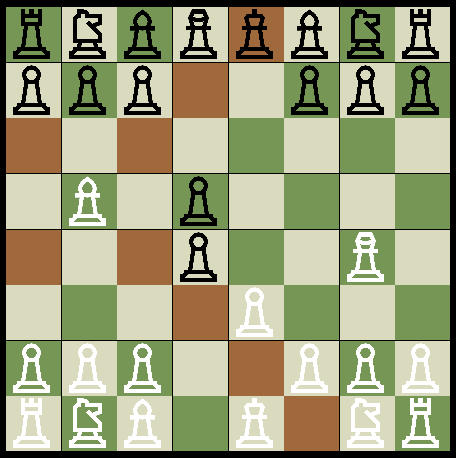

# PyChess
This is a basic player vs player chess game developed with Pygame for an
assignment. The assignment had very few requirements:
- Develop a game using Pygame (we choose the game ourselves)
- Develop the game with focus on OOP (object-oriented programming)

---

## Features
- select/deselect/move a chess piece with left mouse button
- show available moves for the selected piece
- take other pieces
- epic sound effects

That's about it. The game was already way bigger than the teacher expected, so I
decided not to create the following:
- splash screen
- menu
- end screen
- chess notation
- mate and checkmate
- castling
- change piece (whatever it's called when the pawn gets to the end (too lazy to Google so I'm gonna spend more time writing this than actually googling it))

---

